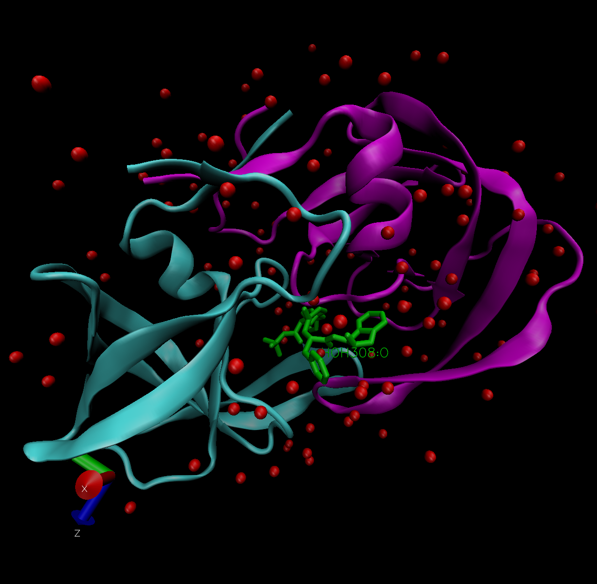
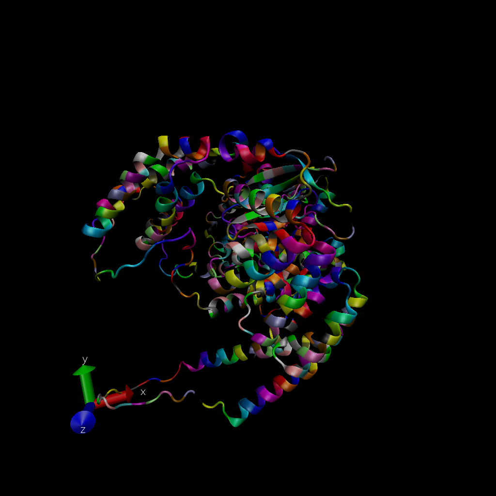

## Protein structure
I downloaded the file "Data Export Summary.csv" from csv. I replaced the spaces with _.

```{r}
#important to specify row names to make everything in the dataframe numbers
pdb_export <- read.csv("Data_Export_Summary.csv", row.names = 1)
pdb_export
```


```{r}
#total number of structures
total_structures <- sum(pdb_export$Total)
#total XRay and NMR
total_x <- sum(pdb_export$X.ray)
total_n <- sum(pdb_export$EM)
#percent
pc_x <- (total_x/total_structures)*100
pc_em <- (total_n/total_structures)*100

#the easier way: use colSums for each column in the table, and refer to those when calculating percent. To specify significant figures, use round()
totals <- colSums(pdb_export)
percents <- totals/totals["Total"]*100
round(percents, 3)
```
#Q1: What percentage of structures in the PDB are solved by X-Ray and Electron Microscopy. 
About 87.2% are solved by X-Ray, and about 5.4% are solved by EM. The percent of X-Ray structures is `r round(pc_x,3)`% and the percent of EM structures is `r round(pc_em,3)`%.

```{r}
#already have total structures
protein_structures <- (pdb_export$Total[1]/totals["Total"])*100
```

#Q2: What proportion of structures in the PDB are protein?
About `r round(protein_structures, 3)`
#Q3: Type HIV in the PDB website search box on the home page and determine how many HIV-1 protease structures are in the current PDB?
When I search HIV-1, I don't find any proteases in the current PDB.

##The PDB format
#Visualizing the HIV-1 protease structure

#Q4: Water molecules normally have 3 atoms. Why do we see just one atom per water molecule in this structure?
Hydrogens are too small to resolve. The PDB webpage showed the resolution to be 2 angstroms, and hydrogen is smaller than that. So we only see the oxygen atom for each water molecule.

#Q5: There is a conserved water molecule in the binding site. Can you identify this water molecule? What residue number does this water molecule have (see note below)?
I found the binding site by visualizing not protein (small molecule), which should be in the binding site. There was one water molecule near this small molecule, labeled HOH3O8:0.

#Q6: As you have hopefully observed HIV protease is a homodimer (i.e. it is composed of two identical chains). With the aid of the graphic display and the sequence viewer extension can you identify secondary structure elements that are likely to only form in the dimer rather than the monomer?
The binding site

#inserting image file



##Bio3d
```{r}
#install and load bio3d
#install.packages("bio3d")
library(bio3d)
#read pdb file to R
pdb <- read.pdb("1hsg")
pdb
#to find 3 letter  ode for amino acid 
aa321("GLN")
```
#Q7: How many amino acid residues are there in this pdb object?
198
#Q8: Name one of the two non-protein residues?
HOH (water)
#Q9: How many protein chains are in this structure?
2

##Comparative structure analysis of Adenylate Kinase
```{r}
#after installing required packages
#for packages not from CRAN
#BiocManager::install("msa")
#for packages from github or bitbucket
#devtools::install_bitbucket("Grantlab/bio3d-view")
```
Q10. Which of the packages above is found only on BioConductor and not CRAN?
msa
Q11. Which of the above packages is not found on BioConductor or CRAN?:
bio3d_view
Q12. True or False? Functions from the devtools package can be used to install packages from GitHub and BitBucket? 
TRUE

```{r}
aa <- get.seq("1ake_A")
aa
```

#Q13. How many amino acids are in this sequence, i.e. how long is this sequence?
214 amino acids

To find related sequences:
```{r}
# Blast or hmmer search 
#b <- blast.pdb(aa)
#did not use for markdown because it takes too long

```
```{r}
# Plot a summary of search results
#hits <- plot(b)
```

```{r}
# List out some 'top hits'
#head(hits$pdb.id)
hits <- NULL
hits$pdb.id <- c('1AKE_A','6S36_A','6RZE_A','3HPR_A','1E4V_A','5EJE_A','1E4Y_A','3X2S_A','6HAP_A','6HAM_A','4K46_A','3GMT_A','4PZL_A')
```
#Align and superpose structures
```{r}
# Download releated PDB files
files <- get.pdb(hits$pdb.id, path="pdbs", split=TRUE, gzip=TRUE)
```
```{r}
#if (!require("BiocManager", quietly = TRUE))
    #install.packages("BiocManager")
# Align releated PDBs
pdbs <- pdbaln(files, fit = TRUE, exefile="msa")
```

```{r}
# Vector containing PDB codes for figure axis
ids <- basename.pdb(pdbs$id)

# Draw schematic alignment
plot(pdbs, labels=ids)
```

#Principal component analysis
```{r}
# Perform PCA
pc.xray <- pca(pdbs)
plot(pc.xray)
```

```{r}
# Calculate RMSD
rd <- rmsd(pdbs)

# Structure-based clustering
hc.rd <- hclust(dist(rd))
grps.rd <- cutree(hc.rd, k=3)

plot(pc.xray, 1:2, col="grey50", bg=grps.rd, pch=21, cex=1)
```

#Alphafold structure prediction for find-a-gene match
https://www.ebi.ac.uk/Tools/sss/ncbiblast/
>1-1773_3 1236 CloneMiner (cat#11144-010) Aureococcus anophagefferens cDNA 5', protein sequence
LRAGHRARAAALGGVGAAGSAEFAEPVVPLRAPARGRGAAAAGRGRPGRRRRRAPRRLAR
RAAAAHRAHRRRGRVAEIGAPSPLGAARRAPPAGAGLPPEFAIEVAARRAAPRGRGHHAG
AADRRAAARRPGAPRLRGAHPRRDPMAREVARGARGGEPPVLRRRRRRRHAADPAAAPRG
ALRGSDDASRGGVPAGLRAGSGRGRGCLDDYERHARAEDRLGRGGDRGDGDARRRLREDA
DAALNQAWDLYYTVFRRVNKQLPQLTTLELRYVSPALLGARSLDLAVPGTYRVDGAGARI
SRFSPSVHVITSKQRPRRLAMKGEDGREYGFLLKGHEDLRQDERAMQLFGLANALLAKDR
RTREHGHLSIQRYAVTPLSHNCGVVGWVPACDTLHALVRDFRDARKIVLNVEHRVMLQLA
PDYDALSLPQKVEVFDAALANTAGHDLSKVLWLKSSHSEQWLERRTHYARSLAAMSMVGH
ILGLGDRHPSNLMLDRRTGKVLHIDX



